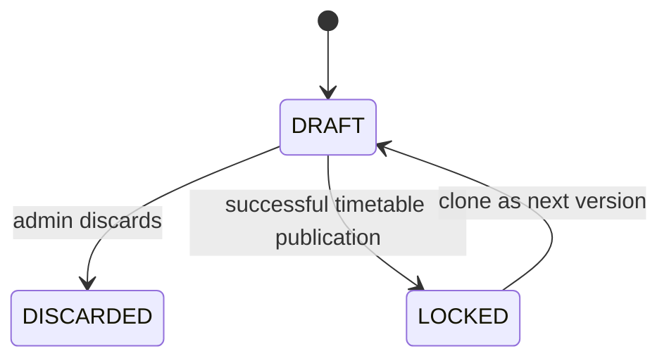
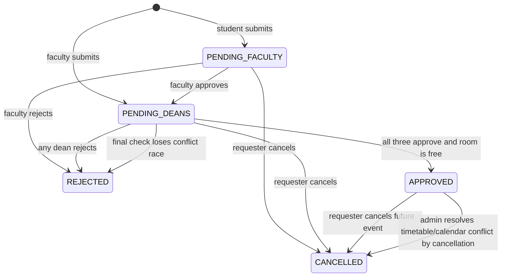

# URAS Phase 1 Technical Design

## Document Status

This document defines how Phase 1 of the greenfield URAS product will be implemented in `Software_Project`.

It translates [URAS_PRODUCT_FEATURE_SPEC.md](URAS_PRODUCT_FEATURE_SPEC.md) into system boundaries, data flows, state transitions, API modules, concurrency controls, frontend work areas, and an implementation sequence. The database contract is defined in [final_db_schema_spec.md](final_db_schema_spec.md) and [Software_Project/prisma/schema.prisma](Software_Project/prisma/schema.prisma).

No application feature implementation or database migration is authorized merely by this document. The design and prepared schema should be reviewed first.

## 1. Chosen Architecture

URAS Phase 1 will be a feature-oriented modular monolith:

- One React web application.
- One Express API process.
- One PostgreSQL database.
- Prisma as the only application ORM and database access path.
- Persistent in-app notifications in PostgreSQL.
- Synchronous business transactions for approval, publication, cancellation, and administrative conflict resolution.

This shape is intentionally modest. The expected institution-scale workload does not justify microservices, distributed queues, Redis-dependent correctness, or a separate timetable engine.

### 1.1 Target Repository

`Software_Project` is the implementation target. Breaking changes are permitted because its current code is exploratory.

The non-legacy directories of `Software-engineering-project` remain a behavior and UI reference. They are not the production backend foundation.

### 1.2 Technology Direction

| Layer | Direction |
| --- | --- |
| Web | React, TypeScript, Vite, React Router, TanStack Query, React Hook Form, Zod, existing component conventions. |
| API | Node.js, modern ESM JavaScript, Express 5, Zod request validation, JSDoc contracts, ESLint, and Pino structured logging. |
| Data | PostgreSQL and Prisma. |
| Authentication | Institution-approved accounts with both password and Google login issuing the same opaque, revocable database-backed session cookie. No URAS-issued JWT session. |
| Uploads | Size-limited `.xlsx` upload parsed through an isolated spreadsheet adapter. |
| Exports | Streamed CSV generated from authorized filtered queries. |

The API will remain JavaScript. Runtime boundaries use Zod, service inputs and outputs use JSDoc types, and strict ESLint rules prevent implicit globals and unsafe patterns. The React frontend remains TypeScript because its existing type-safe component and API patterns are useful and already established.

## 2. What Is Reused and What Is Replaced

### 2.1 Reused Product and Engineering Ideas

From `Software-engineering-project`:

- Role-aware dashboards and navigation.
- Availability search, room timeline, room directory, request lists, notifications, user administration, calendar management, and timetable workspace behavior.
- React Query based server-state handling.
- Feature-module route registration.
- Central request validation and global error handling.
- Staff building scope and privacy-aware occupancy display.

From `Software_Project`:

- Prisma/PostgreSQL direction.
- Normalized buildings, rooms, slot systems, slots, occurrences, courses, and room allocations.
- Date plus minute representation for room scheduling.
- Lightweight Express and Pino foundation.

### 2.2 Replaced Designs

- Drizzle and Prisma will not coexist in the target application.
- The 5,000-line timetable import/commit engine will not be ported.
- No process-memory booking freeze.
- No timetable date-occurrence expansion.
- No duplicate `bookings` and `booking_requests` sources.
- No single staff approval workflow.
- No single-dean field or dean ID counter array.
- No mutable published slot grid.
- No Redis availability cache until measurements prove it necessary.
- No generic base repository abstraction.

## 3. Proposed Repository Layout

```text
Software_Project/
  prisma/
    schema.prisma
    migrations/
    seed/
  src/
    app.js
    server.js
    config/
    db/
    modules/
      auth/
      users/
      academic-terms/
      buildings/
      rooms/
      slot-systems/
      timetable-imports/
      calendar-exceptions/
      availability/
      booking-requests/
      approvals/
      notifications/
      dashboards/
    shared/
      errors/
      middleware/
      pagination/
      time/
      validation/
  frontend/
    src/
      auth/
      components/
      features/
      pages/
      routes/
      lib/api/
```

Each backend feature owns its routes, validators, service methods, queries, and DTO mapping. Cross-feature operations are coordinated by a small use-case service in the module that owns the state transition.

Controllers validate and translate HTTP. They do not contain business rules. Prisma transaction boundaries live in services, not repositories or route handlers.

## 4. Backend Module Responsibilities

| Module | Owns |
| --- | --- |
| `auth` | Login, Google callback, sessions, logout, current identity. |
| `users` | Approved-user allowlist, activation, base roles, profiles, dean offices, staff-building assignments. |
| `academic-terms` | Planned/current/closed lifecycle and the one-current-term rule. |
| `buildings` | Building directory and active state. |
| `rooms` | Rooms, room types, operational state, restrictions, suitability filters. |
| `slot-systems` | Dynamic systems, draft grid versions, slots, occurrences, validation, clone/discard. |
| `timetable-imports` | File validation, parsing, normalization, staging, row resolution, publication revisions, atomic replacement, and projection rebuild. |
| `calendar-exceptions` | No-class and follow-day rules and impact preview. |
| `availability` | Combined occupancy decisions, pending warnings, room search, timeline, suggestions. |
| `booking-requests` | Request creation, cancellation, requester lists, booking history. |
| `approvals` | Faculty decision, three-dean decisions, final approval, competing-request rejection. |
| `notifications` | In-app creation, listing, unread count, read state. |
| `dashboards` | Role-specific summaries assembled from module-owned queries. |

Modules may read another module's public query service. They must not update another module's tables directly except inside an explicitly documented cross-module transaction.

## 5. Authentication and Authorization

### 5.1 Authentication

- Registration is limited by active `ApprovedUser` records.
- Both password and Google login are available to ordinary approved users.
- Password credentials are hashed using a modern adaptive password hash.
- Google sign-in maps the verified institutional email and Google subject to the same `User`.
- A random session token is returned only in an `HttpOnly`, `Secure`, `SameSite` cookie.
- Only a cryptographic hash of the session token is stored in `AuthSession`.
- Every protected request checks session expiry and `User.isActive`.
- Logout revokes the current session; password or role security changes may revoke all sessions.
- URAS does not issue JWT access or refresh tokens for application sessions. Any Google ID token is verified only during the OAuth exchange and is not used as the URAS session.

The API must not place role authorization solely in frontend route guards.

### 5.2 Authorization Matrix

| Capability | Student | Faculty | Dean office holder | Staff | Admin |
| --- | --- | --- | --- | --- | --- |
| Check availability | Yes | Yes | Yes | Yes | Yes |
| Create event request | Own | Own | Own as faculty | No unless separately faculty | Optional administrative view only |
| Faculty verification | No | Assigned requests | If assigned as faculty | No | No bypass |
| Dean decision | No | Only if office holder | Assigned office tasks | No | No bypass |
| View booking history | Own | Own and assigned student requests | All booking history | Assigned buildings | All |
| Resolve timetable/calendar event conflicts | No | No | View history | View affected room schedules | All |
| Manage room restrictions | No | No | View | Assigned buildings | All buildings |
| Manage terms, grids, imports | No | No | View where useful | View operational results | All |

Dean authority is evaluated from `DeanOfficeAssignment`, not from a `DEAN` base-role enum.

## 6. Date, Time, and Overlap Rules

- Institution timezone: `Asia/Kolkata`.
- Booking and restriction input: ISO date plus `startMinute` and `endMinute`.
- Valid range: `0 <= startMinute < endMinute <= 1440`.
- Overlap condition: `existing.startMinute < requested.endMinute AND existing.endMinute > requested.startMinute`.
- Adjacent intervals do not overlap.
- Audit and lifecycle timestamps are UTC-compatible timezone-aware instants and are displayed in institution time.

A shared time module owns parsing, validation, weekday conversion, date formatting, and half-open overlap helpers. Modules do not implement their own variants.

## 7. Availability Design

### 7.1 Evaluation Order

For each requested room/date/time:

1. Confirm the building and room are active and the room meets requested capacity/features.
2. Check active `RoomRestriction` overlap.
3. Locate the current academic term when the date is inside its boundary.
4. Resolve any calendar exception for that date.
5. If classes apply, query `RoomSlotOccupancy` using the actual or mimicked weekday.
6. Query overlapping `APPROVED` `BookingRequest` records.
7. Query overlapping pending requests for warnings.
8. Return a structured decision and privacy-filtered explanations.

`NO_CLASSES` skips step 5 only. It does not suppress approved events or room restrictions.

### 7.2 Query Shape

The hot path uses indexed `EXISTS` or batched lookups. It does not need to join terms, publications, assignments, slots, and rooms for every candidate.

For one room, the normal decision requires approximately four to six small indexed reads. For a room search, the same sources are queried in batches by candidate room IDs. Descriptive joins run only for conflicts included in the response.

Pending warnings are computed separately and never participate in the occupied boolean.

### 7.3 Response Contract

```json
{
  "roomId": "room_id",
  "date": "2026-10-24",
  "startMinute": 600,
  "endMinute": 660,
  "isAvailable": false,
  "blockingReasons": [
    {
      "source": "ACADEMIC_TIMETABLE",
      "startMinute": 570,
      "endMinute": 620,
      "label": "CSL2020"
    }
  ],
  "pendingWarningCount": 2
}
```

Ordinary users see that another event exists without receiving another requester's private purpose or contact details.

## 8. Slot Grid Lifecycle



Only `DRAFT` rows and their child slots/occurrences are mutable. Editing a live grid means cloning it, editing the clone, uploading a replacement timetable against it, and publishing both together.

The current published batch and its grid remain live throughout preview and resolution.

## 9. Timetable Import

### 9.1 Upload Contract

- Accepted Phase 1 file: `.xlsx`.
- Required logical headers: `Course Code`, `Slot`, and `Classroom`.
- One physical classroom per row.
- The same course and slot may repeat with different classrooms.
- Term, slot system, and grid version are selected in the UI.
- Optional columns are retained in `auxiliaryData`.
- Upload size, worksheet count, row count, and cell text length are bounded.

### 9.2 Preview Pipeline

1. Validate file type and size.
2. Compute SHA-256 file hash.
3. Parse the selected worksheet into bounded raw rows.
4. Detect and normalize headers.
5. Normalize course, slot, and room values.
6. Apply stable slot aliases in code.
7. Resolve known courses, slots, rooms, and faculty.
8. Detect missing values, ambiguous mappings, exact duplicates, and academic room conflicts.
9. Save the batch and every row.
10. Return a paginated preview summary.

The parser is an adapter behind a narrow interface so a spreadsheet library can be replaced without changing import business rules.

### 9.3 Resolution

An administrator may resolve the slot, course, and one room or skip the row with a reason. Multi-room course-slot groups use several spreadsheet rows. The original classification and raw row never change.

Valid rows are ready without an administrative decision. A problematic row becomes ready after `RESOLVE` or `SKIP` has complete metadata.

When a preview contains many systematic issues, the administrator may upload a corrected workbook as a replacement. The new workbook is parsed successfully before the earlier preview is cancelled, and the UI compares issue totals between both previews. This remains a staging action and never changes the currently published timetable.

## 10. Atomic Timetable Publication

Publication uses one short, protected transaction rather than a multi-phase commit session.

Before the transaction, the service builds the intended publication and returns every conflicting approved booking with suitable room/date suggestions. The administrator submits one `RELOCATE`, `RESCHEDULE`, or `CANCEL` decision for each conflict. The transaction then:

1. Acquires the system occupancy advisory lock.
2. Re-reads the candidate batch, current published batch, grid version, and relevant approved events.
3. Recomputes the impact and rejects stale or incomplete decisions with a refreshed preview.
4. Revalidates every selected replacement room/date/time against current occupancy and against all other decisions in the same command.
5. Marks the previous published batch `SUPERSEDED` and deletes its projection rows.
6. Marks the candidate batch `PUBLISHED` with its revision and publisher, then inserts normalized academic source records and projection rows.
7. Applies each booking relocation, reschedule, or cancellation directly to `BookingRequest`.
8. Appends complete before/after booking history and requester notifications.
9. Links the batch revisions and locks the grid version.

If any insert, constraint, or state check fails, PostgreSQL rolls back all changes and the previous batch remains published.

Publication has academic priority. A conflict does not permanently block publication, but confirmation requires a complete valid administrative outcome for every affected event.

## 11. Booking State Machine



Terminal requests are not reopened in Phase 1.

## 12. Approval Transactions

### 12.1 Faculty Decision

The transaction verifies the assigned pending faculty approval and active reviewer. Approval changes the faculty task, creates all three dean tasks from current office assignments, updates request status, writes history, and creates notifications.

If any office assignment is missing or inactive, no partial dean workflow is created.

### 12.2 Dean Rejection

The transaction updates the acting dean task to `REJECTED`, changes the request to `REJECTED`, closes remaining pending approvals, writes history, and notifies involved users.

### 12.3 Dean Approval Before the Final Vote

The transaction updates only that dean's task, appends history, and notifies the requester of progress. The request remains `PENDING_DEANS`.

### 12.4 Final Dean Approval

The final transition:

1. Acquires the system occupancy advisory lock.
2. Locks or conditionally updates the request version.
3. Confirms the dean task is still pending.
4. Re-runs complete availability.
5. Updates the final task and request to `APPROVED`.
6. Appends history and notifications.
7. Finds other overlapping pending requests for the same room/date/time.
8. Rejects them, closes their pending approval tasks, and creates history and notifications with a system conflict message plus the final approver's optional privacy-safe shared note.

The partial PostgreSQL exclusion constraint on approved requests is the final overlap backstop.

Retries return the already-recorded decision rather than inserting another approval.

## 13. Cancellation and Administrative Conflict Resolution

### 13.1 Cancellation

A requester may cancel their future pending or approved event with a reason. The transaction:

- Rechecks that the event has not started.
- Changes status to `CANCELLED`.
- Closes pending approval tasks.
- Appends booking history.
- Creates notifications for the requester, faculty where applicable, all dean reviewers, and responsible building staff.

An approved room is released immediately because only `APPROVED` requests count as event occupancy.

### 13.2 Conflict Decision Payload

Timetable publication and calendar-exception confirmation accept one decision per currently conflicting approved booking:

- `RELOCATE`: replacement room, original date and time, and reason.
- `RESCHEDULE`: replacement room, date, start minute, end minute, and reason.
- `CANCEL`: required reason.

The preview decisions are not a separate workflow table or queue. The confirmation request carries them with the previewed booking versions. The server recomputes impact and rejects the command if any decision is missing, stale, no longer available, or conflicts with another replacement in the same command.

The confirmation UI renders one card per affected event. Relocation keeps date and time while selecting a suitable available room. Rescheduling edits room, date, start minute, and end minute. Cancellation requires a reason. A summary keeps confirmation disabled until every card contains a valid decision.

### 13.3 Applied Outcomes

Relocation and rescheduling keep the request `APPROVED` while updating its room/date/time and incrementing its version. Cancellation changes it to `CANCELLED`. `BookingActionHistory.metadata` preserves the trigger, old values, new values, administrator, and reason. The requester receives the final result after commit.

## 14. Room Restrictions and Deactivation

Building staff may create or cancel restrictions only for assigned buildings; administrators may act globally. A Phase 1 restriction command acquires the system occupancy advisory lock and is rejected if its interval overlaps published academic occupancy or an approved event.

A room deactivation command uses the same lock and may proceed only when the room has no applicable published academic occupancy, future approved event, or current or future active restriction. The API returns the blocking records instead of creating a displacement workflow.

A building deactivation command uses the same rule across all rooms in that building and returns the blocking rooms and schedules if any room is not eligible.

Emergency closure that overrides confirmed occupancy is deferred to Phase 2.

## 15. Calendar Exception Changes

The service validates term bounds and prohibits overlapping active exceptions. Removing an exception deactivates it, records the updater and deactivation time, and does not delete the record.

Changing an exception computes the difference between old and new effective timetable occupancy. The administrator sees affected approved events and submits a relocate, reschedule, or cancel decision for each one. Confirmation acquires the system occupancy advisory lock, recomputes the impact, and applies the calendar change and all booking outcomes atomically. If it only releases academic occupancy, no event state changes automatically.

Phase 1 exceptions are institution-wide within the selected term.

## 16. Notifications

Phase 1 notifications are database rows inserted in the same transaction as the event they describe. Therefore a successful approval cannot exist without its required in-app notification records.

Notification API capabilities:

- Paginated list.
- Unread count.
- Mark one read.
- Mark all read.
- Open linked resource.

Email and external delivery do not participate in Phase 1 correctness.

## 17. Audit and History

### 17.1 Booking History

`BookingActionHistory` records booking-specific transitions. Services append it in the same transaction as the request or approval update.

### 17.2 Administrative Audit

`AdministrativeAuditEvent` and its enums are reserved in the schema, but Phase 1 does not write or expose them. Configuration records rely on native timestamps and explicit actor fields where present. This is operational attribution, not complete before/after auditing.

Phase 2 may implement transactional before/after events, authorization, filtering, export, and redaction if institutional compliance requires them. Sensitive values such as password hashes, session tokens, cookies, and OAuth secrets must never be placed in audit JSON.

### 17.3 Access and Export

- Students: own booking history.
- Faculty: own requests and assigned student requests.
- Dean office holders: all booking history.
- Staff: booking history for assigned buildings.
- Admins: all booking history.

History supports last 7 days, last 30 days, custom dates, room, building, actor, action, and status filters. CSV export calls the same authorized query builder as the on-screen list.

## 18. HTTP API Boundaries

All endpoints are under `/api/v1`. Exact payload details will be defined with Zod beside each module.

| Area | Representative endpoints |
| --- | --- |
| Auth | `/auth/login`, `/auth/google`, `/auth/logout`, `/auth/me` |
| Users | `/admin/users`, `/admin/approved-users`, `/admin/dean-offices`, `/admin/staff-building-assignments` |
| Terms | `/academic-calendar/terms`, `/academic-calendar/terms/:id/set-current`, `/academic-calendar/terms/:id/close` |
| Buildings | `/facilities/buildings`, `/facilities/buildings/:id` |
| Rooms | `/facilities/rooms`, `/facilities/rooms/:id`, `/facilities/restrictions` |
| Slots | `/slot-systems`, `/slot-systems/:id/grid-versions`, `/grid-versions/:id/slots` |
| Imports | `/timetable-imports`, `/timetable-imports/:id/rows`, `/timetable-imports/:id/resolutions` |
| Publications | `/timetable-imports/:id/publication-preview`, `/timetable-imports/:id/publish`, `/timetable-imports/:id` |
| Calendar | `/academic-calendar/exceptions`, `/academic-calendar/exceptions/impact`, `/academic-calendar/exceptions/:id/deactivate` |
| Availability | `/availability/rooms`, `/availability/rooms/:id`, `/availability/rooms/:id/timeline` |
| Requests | `/booking-requests`, `/booking-requests/:id`, `/booking-requests/:id/cancel` |
| Approvals | `/approvals/me`, `/booking-requests/:id/approvals/:role/decision` |
| Notifications | `/notifications`, `/notifications/unread-count`, `/notifications/:id/read` |
| History | `/booking-history`, `/booking-history/export` |
| Dashboards | `/dashboard` |

Commands that may be retried accept an idempotency key or enforce idempotency from current state and unique constraints.

## 19. API Response and Error Rules

Successful responses use stable DTOs rather than exposing Prisma records directly. Lists include cursor or page metadata and a deterministic sort.

Errors contain:

```json
{
  "error": {
    "code": "ROOM_NO_LONGER_AVAILABLE",
    "message": "The room was approved for another request.",
    "details": {},
    "correlationId": "request-correlation-id"
  }
}
```

Expected conflicts return `409`; invalid input returns `400` or `422`; missing authentication returns `401`; insufficient scope returns `403`; missing records return `404`.

Internal stack traces and database details are never returned to users.

## 20. Frontend Migration

The mature frontend is a behavior and interaction reference, not an API contract that constrains the new backend.

### 20.1 Retained Workflows

- Login and profile setup.
- Role-aware application shell and dashboard.
- Availability search and room timeline.
- Building and room administration.
- Booking request creation and progress.
- Approval queues.
- Timetable structure, import preview, resolution, and publication views.
- Calendar exception administration.
- Notifications.

### 20.2 Required Changes

- Replace staff approval UI with faculty plus DOSA, ADOSA, and DOAA progress.
- Add term management and current-term status.
- Add dynamic slot-system management and draft grid revisions.
- Replace commit-session screens with Preview, Resolve, Impact, and Publish.
- Show pending-request warnings without private competing-request details.
- Add timetable and calendar conflict-resolution panels inside their confirmation flows.
- Add approved-event cancellation with required reason.
- Add booking history filters and CSV download.
- Add administrator audit log.
- Update status labels for `PENDING_DEANS` and administrative booking changes.

React Query keys will be feature-scoped. Mutations invalidate only affected summaries, lists, timelines, and notification counts.

## 21. Performance Strategy

- Build indexes around actual date, room, status, reviewer, and scope filters.
- Use `RoomSlotOccupancy` for recurring timetable reads.
- Batch availability by room IDs instead of issuing one query per room.
- Paginate all operational and history lists.
- Stream CSV exports rather than loading unbounded history into memory.
- Parse uploads with file and row limits.
- Use short transactions and perform spreadsheet parsing before publication transactions.
- Measure query plans before adding caches.

Redis is not a Phase 1 dependency. Availability correctness must not depend on cache invalidation.

## 22. Security

- Zod validates params, query, body, and upload metadata.
- Authorization runs server-side for every protected command and query.
- Session cookies use secure production flags and CSRF protection appropriate to the chosen cookie strategy.
- Login and sensitive endpoints are rate-limited.
- Uploaded workbooks are never executed and formulas are treated as data.
- File type is checked by content and extension, with strict size limits.
- CSV export neutralizes spreadsheet-formula injection in text cells.
- Logs redact credentials and tokens. Future administrative audit events must apply the same rule.
- CORS uses an explicit production origin.
- Database credentials follow least privilege.

## 23. Observability and Recovery

Every request receives a correlation ID included in structured logs.

The API logs startup, authentication failures, validation summaries, transaction failures, publication outcomes, constraint conflicts, notification insertion failures, and projection integrity failures without logging sensitive payloads.

Operational health includes:

- API liveness.
- Database readiness.
- Current term presence.
- Dean office assignment completeness.
- Current publication status by active slot system.
- Pending timetable or calendar confirmations with unresolved conflict decisions.
- Occupancy projection integrity result.

Database backup and restore procedures must include configuration, published timetable batches, requests, approvals, notifications, and booking history. The projection can be rebuilt after restore.

## 24. Verification Strategy

Development may proceed functionality-first, but production deployment requires automated coverage for:

- Half-open overlap boundaries.
- One-current-term and one-live-publication constraints.
- Holiday and follow-day behavior.
- Multi-room course grouping.
- Import duplicate and resolution behavior.
- Parallel three-dean decisions.
- Concurrent final approval of competing requests.
- Timetable publication racing final approval.
- Failed replacement rollback.
- Timetable and calendar conflict relocation, rescheduling, and cancellation.
- Stale conflict-preview rejection.
- Approved cancellation and room release.
- Staff building scope and history export scope.
- Append-only booking-history behavior.

Unit tests cover pure normalization and state rules. Integration tests use real PostgreSQL for constraints and transactions. A small end-to-end suite covers the highest-risk user workflows.

## 25. Phase 1 Implementation Sequence

### Foundation

1. Establish strict ESM JavaScript, JSDoc contracts, ESLint, and feature-module registration.
2. Finalize and migrate the Prisma schema to a clean development database.
3. Add configuration, structured errors, validation, logging, session auth, and authorization middleware.
4. Establish the React application under `Software_Project/frontend` using the mature UI as the interaction reference.

### Institutional Configuration

5. Implement users, approved identities, profiles, dean offices, and staff-building assignments.
6. Implement buildings, rooms, room types, room state, and room restrictions.
7. Implement academic terms and calendar exceptions.
8. Implement dynamic slot systems, draft grid versions, slots, and occurrences.

### Academic Timetable

9. Implement spreadsheet parsing, normalization, staging, preview, and row resolution.
10. Implement publication validation, atomic replacement, and occupancy projection rebuild.
11. Implement publication impact preview and inline administrative conflict decisions.

### Room Workflow

12. Implement combined availability, room search, timeline, and suggestions.
13. Implement student and faculty booking requests.
14. Implement faculty and three-dean approval state machines with protected final approval.
15. Implement cancellation, competing-request rejection, calendar-change conflict decisions, and notifications.

### Operations

16. Implement booking history, filters, and CSV exports.
17. Implement role dashboards and operational health summaries.
18. Complete critical integration and end-to-end release gates.

Each numbered capability should reach a usable UI/API slice before the next dependent workflow begins.

## 26. Confirmed Policy Decisions

- Both Google and password login are available to ordinary approved users.
- Both login methods create the same opaque database-backed session; URAS does not use JWTs as application sessions.
- DOSA, ADOSA, and DOAA each have one active user, and one user cannot hold more than one dean office.
- Building staff may manage temporary restrictions only for assigned buildings; administrators may manage them globally.
- Room restrictions and room or building deactivation cannot displace confirmed Phase 1 occupancy.
- Timetable and calendar conflicts are resolved by the administrator during confirmation, with no later relocation queue.
- General `AdministrativeAuditEvent` writing, search, and export are deferred to Phase 2.
